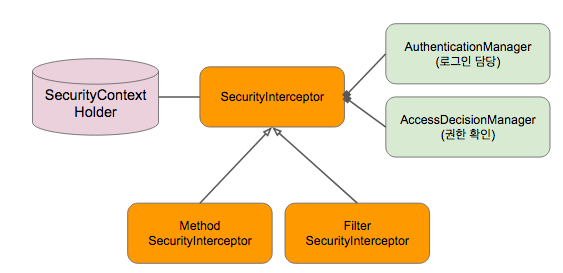

# 스프링 시큐리티
- 웹 시큐리티
    - 웹 요청에 보안 인증을 하는것
    - Filter 기반
- 메소드 시큐리티
    - 웹과 상관없이 특정 Method 가 호출됬을때 인증 권한 체크
    - AOP를 생각
    - Proxy를 사용하여 권한 체크
- 둘다 Security Interceptor 를 사용한다.

- Spring Security Cycle
    1. 사용자가 요청을 보낸다.
        - GET /api/events
    2. Servlet Filter 가 요청을 가로챈다.
    3. Security Filter Interceptor 로 요청을 보낸다.
        - Security Filter를 적용 유무 확인
    4. SecuriyContextHolder에서 인증 정보 확인
        - ThreadLocal (한 쓰레드 내의 공유 저장소)
    5. 인증된 사용자가 없음
        -Security Interceptor가 AuthenticationManager 사용하여 인증수행
        - AuthenticationManager
            - 로그인을 시도한다.
            - AuthenticationManager 가 사용하는 핵심 Interface
                - UserDetailsService
                - PasswordEncoder
        - 인증방법
            - BasicAuthentication
                - 인증 요청헤더
                    - Basic
                    - Authentication
                    - username
                    - password
                    - 를 조합하여 인코딩 한 문자열을 가지고 입력을 받음.
                - UserDetailsService 를 사용하여 Username 에 해당한 사용자를 DB에서 찾아옴
                - PasswordEncoder를 사용하여 Password가 동일한지 확인.
                - Password 가 일치한다면 유저 객체 생성후 SecurityContextHolder에 담아놓음
    6. 인증된 사용자가 존재
        - AccessDecisionManager
            - 권한 체크
            - Role을 확인하여 체크를 한다.
        - 인증과 인가를 처리한다.
        



- 의존성 추가
```xml
    <dependency>
        <groupId>org.springframework.security.oauth.boot</groupId>
        <artifactId>spring-security-oauth2-autoconfigure</artifactId>
        <version>2.1.0.RELEASE</version>
    </dependency>
```
